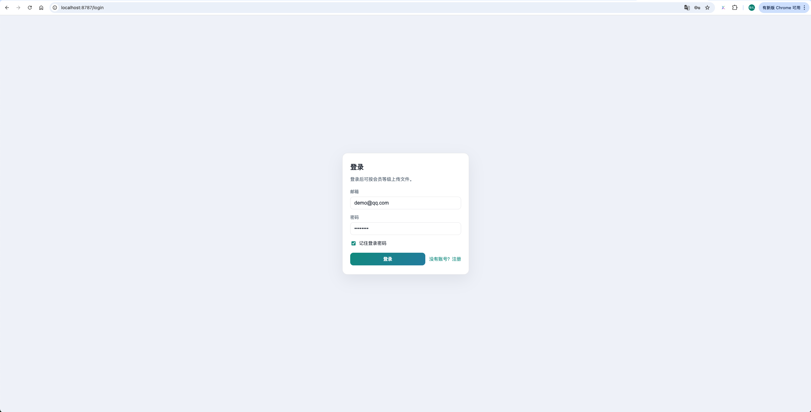
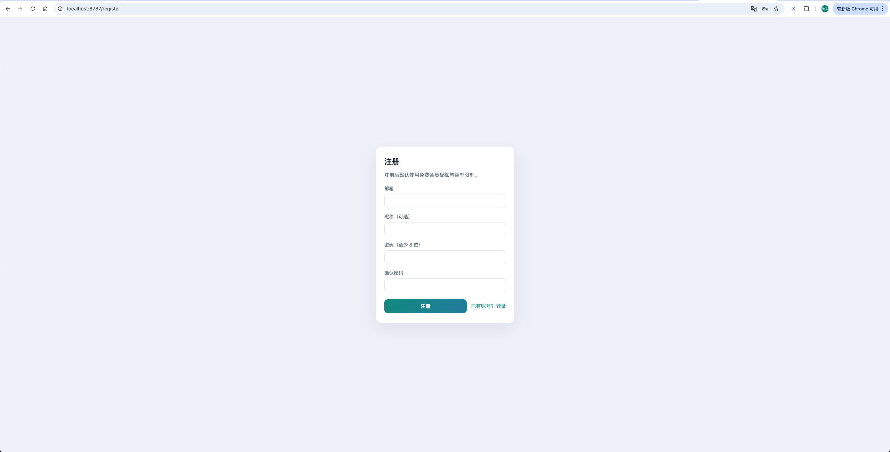
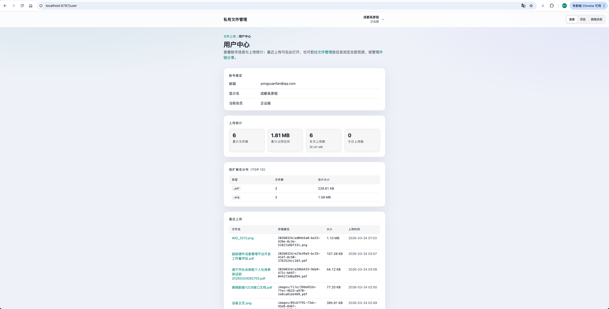
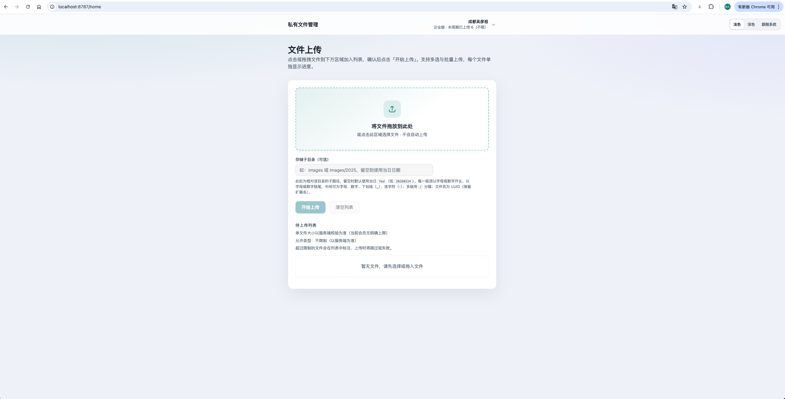
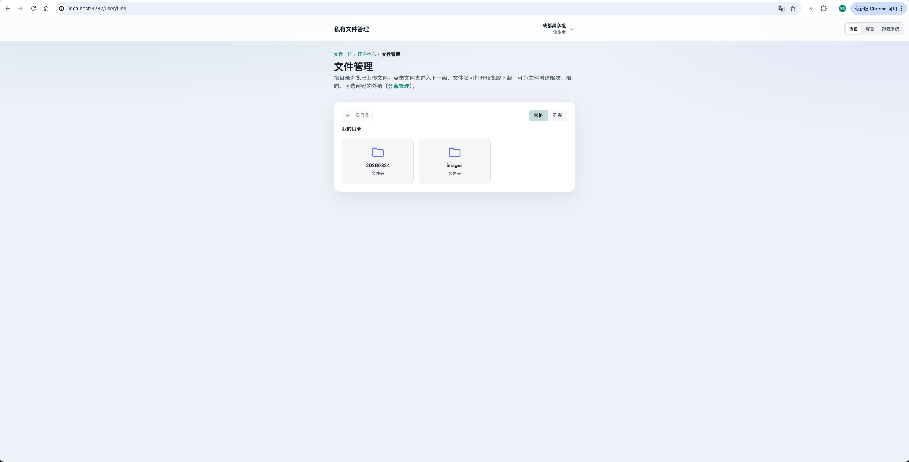
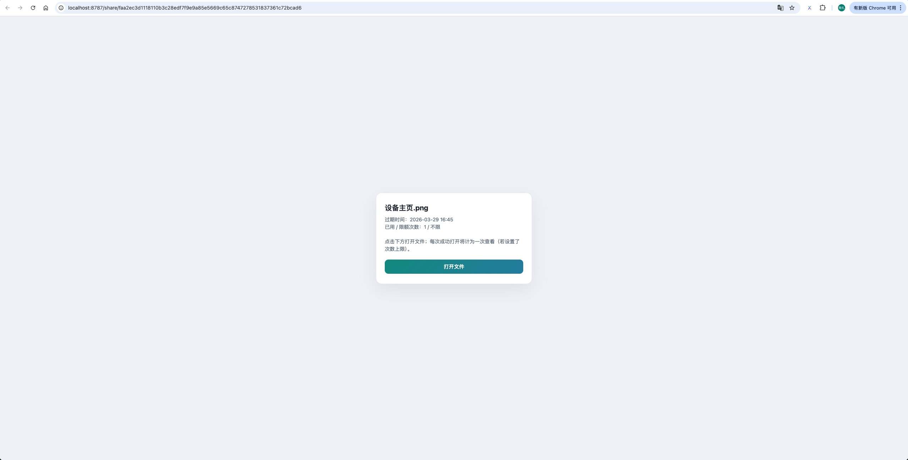
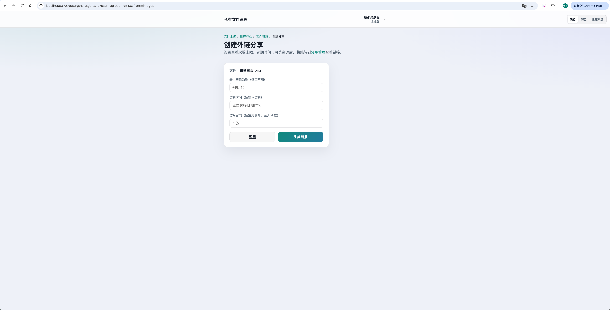
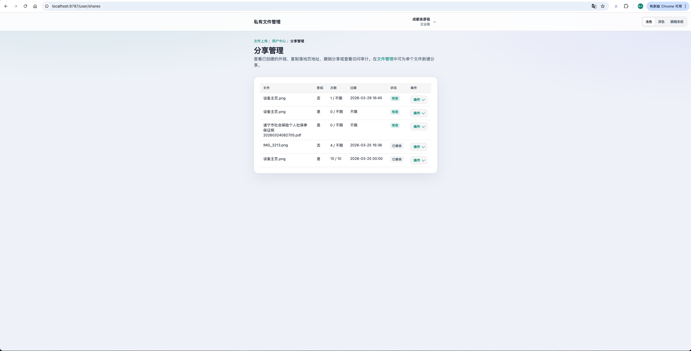
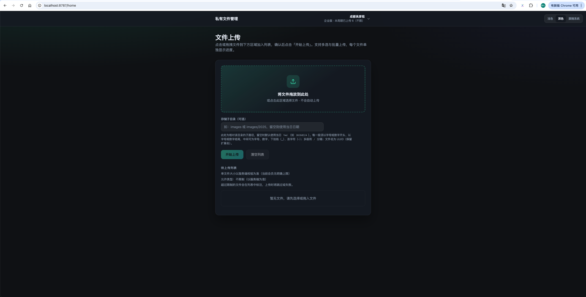

# 私有文件管理

基于 [webman](https://www.workerman.net/webman)（Workerman）的轻量对象存储与用户文件管理 Web 应用：支持登录注册、文件上传与配额、外链分享（可选访问密码）及分享管理。

## 功能概览

- **用户与认证**：登录、登出；注册（可在 `config/app.php` 中通过 `registration_open` 关闭）
- **文件**：上传至 `storage/{用户目录}/`，可按子目录组织；单文件与总用量受会员方案限制
- **访问**：已登录用户可浏览 `/user/files`，通过受控接口读取文件或图片
- **分享**：创建带 token 的外链、`/share/{token}` 落地页、可选密码解锁；分享列表、撤销与访问审计

## 界面预览

以下截图来自仓库 `snapshots/` 目录，按**典型使用流程**排列：先完成账号与登录，再管理文件，最后创建与查看分享；末尾为深色模式与移动端效果。

### 登录与注册





### 用户中心



### 文件：上传、管理与访问







### 分享





### 主题与移动端




## 默认账号

- **用户名**： demo@qq.com
- **密码**：12345678

## 技术栈

- PHP ≥ 8.1
- [webman-framework](https://github.com/walkor/webman) 2.x
- MySQL（[webman/database](https://www.workerman.net/doc/webman/db.html)）
- Redis（[webman/redis](https://www.workerman.net/doc/webman/redis.html)）
- Blade 模板（[webman/blade](https://www.workerman.net/doc/webman/view.html)）
- 路由：控制器上的 `#[Route]` 注解

## 环境要求

- PHP 8.1+，建议开启常用扩展（`pdo_mysql`、`json`、`mbstring` 等）
- MySQL 5.7+ / 8.x
- Redis（若项目或会话依赖 Redis，请按 `config/redis.php` 配置）
- [Composer](https://getcomposer.org/)

## 安装与配置

1. **安装依赖**

   ```bash
   composer install
   ```

2. **数据库**  
   在 MySQL 中创建库并导入表结构（请根据团队提供的 SQL 或迁移脚本执行；仓库若未附带迁移文件，需与维护者确认建表方式）。

3. **修改配置**

   - `config/database.php`：填写数据库连接信息。  
   - `config/redis.php`：按环境修改 Redis 地址与密码。  
   - `config/app.php`：  
     - `site_name`：站点名称  
     - `registration_open`：是否开放自助注册  
     - `share_link_secret`：**生产环境务必改为随机长字符串**，用于分享外链 Cookie 签名  
     - `debug`：生产环境建议设为 `false`

4. **可选：`.env`**  
   若使用环境变量覆盖配置，可在项目根目录放置 `.env`（webman 会在启动时加载）。

## 启动与访问

- **Linux / macOS**

  ```bash
  php start.php start
  ```

- **Windows**  
  使用项目根目录下的 `windows.php` 启动（参见 [webman Windows 文档](https://www.workerman.net/doc/webman/windows.html)）。

默认 HTTP 监听地址见 `config/process.php` 中 `webman.listen`（常见为 `http://0.0.0.0:8787`）。启动后在浏览器中访问该地址即可。

常用进程命令：`start` | `stop` | `restart` | `reload` | `status`。

## 目录说明（简要）

| 路径 | 说明 |
|------|------|
| `app/controller/` | 控制器与路由注解 |
| `app/model/` | 数据模型 |
| `app/service/` | 业务服务（上传策略、存储、分享等） |
| `app/middleware/` | 中间件（登录校验、访客限制等） |
| `app/view/` | Blade 视图 |
| `public/` | 静态资源（CSS/JS 等） |
| `storage/` | 用户上传文件存储根目录 |
| `config/` | 应用与框架配置 |

## 相关文档

- [webman 官方文档](https://webman.workerman.net)
- [webman 安装说明](https://www.workerman.net/doc/webman/install.html)

## 许可证

本项目依赖的 webman 及相关组件遵循各自开源协议；仓库根目录 `LICENSE` 为 webman 原始 MIT 许可证文本。若你对本仓库另有版权声明，请在 `LICENSE` 或文档中补充说明。
